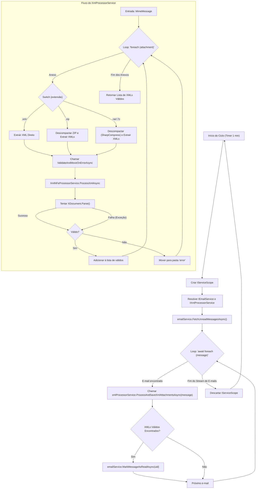

# Estudo de Caso: Serviço de Automação para Coleta de Documentos Fiscais

Este repositório serve como um estudo de caso para um serviço de backend robusto que projetei para automatizar a coleta e processamento de documentos fiscais recebidos por e-mail.

**Nota Importante:** O código-fonte desta solução é propriedade intelectual de um empregador e **não** está incluído neste repositório. Este documento descreve apenas o desafio, a arquitetura da solução e o impacto gerado.

---

## O Desafio (O Problema)

O desafio de negócio começava em uma operação de logística: uma equipe era responsável pelo carregamento de produtos em uma doca, mas esse carregamento era feito "às cegas". Os documentos fiscais (XMLs) que validavam a carga só eram recebidos e processados manualmente após o carregamento. Essa falta de visibilidade prévia gerava avarias e extravios, pois a equipe não possuía um controle assertivo do que, de fato, era carga de sua responsabilidade. O gargalo central que impedia a solução desse problema era o processo manual de obtenção desses XMLs, que chegavam por e-mail. Esse processo manual era:

**Lento e Trabalhoso**: Exigia que a equipe monitorasse constantemente uma caixa de entrada, abrindo e-mails um por um para baixar os anexos.

**Suscetível a Erros**: E-mails eram esquecidos, processados em duplicidade ou tinham seus anexos salvos incorretamente.

**Complexo**: Os documentos chegavam em diversos formatos: .xml diretos ou compactados como .zip, .rar e .7z, muitas vezes contendo múltiplos arquivos.

**Ineficiente**: Em picos de volume, o processo manual não conseguia acompanhar a demanda, gerando gargalos em operações subsequentes (como a liberação da carga, pagamentos e conformidade fiscal).

O objetivo era criar uma solução "sem toque" (zero-touch), totalmente automatizada, confiável e eficiente em termos de recursos.

## A Solução (Minha Abordagem)

Projetei e implementei um *Worker Service* .NET que roda em background 24/7, automatizando completamente esse fluxo de trabalho.

A arquitetura da solução foi baseada nos seguintes pilares:

1.  **Conectividade Segura e Robusta:** A aplicação utiliza o protocolo IMAPS para se conectar de forma segura ao servidor de e-mail e monitorar uma caixa de entrada específica, garantindo a confidencialidade dos dados.

2.  **Processamento Eficiente de E-mails:**
    * Para garantir um baixo uso de memória (`low memory footprint`) mesmo sob alto volume, o processamento de e-mails é feito como um fluxo de dados assíncrono (`IAsyncEnumerable`).
    * O serviço foca apenas em e-mails "não lidos", utilizando um filtro dinâmico que busca por múltiplos remetentes.

3.  **Filtragem e Configuração Flexível:**
    * Toda a configuração (credenciais, servidor, e a lista de remetentes autorizados) é gerenciada externamente via `appsettings.json`. Isso permite que a equipe de operações adicione ou remova fornecedores sem a necessidade de *recompilar* ou *reimplantar* a aplicação.

4.  **Extração Inteligente de Anexos:**
    * O serviço identifica e baixa anexos `.xml` diretos.
    * Sua principal capacidade é a descompactação automática e em memória de arquivos `.zip`, `.rar` e `.7z`, extraindo todos os arquivos XML válidos contidos neles.

5.  **Garantia de Entrega (Idempotência):**
    * Para evitar processamento duplicado, a aplicação marca o e-mail como "lido" no servidor IMAPS **somente após** o download e salvamento bem-sucedido de todos os seus anexos.

6.  **Arquitetura Limpa (Clean Architecture):**
    * O código foi estruturado seguindo os princípios SOLID e de Arquitetura Limpa.
    * O uso intensivo de Injeção de Dependência (DI) desacopla os componentes (ex: o serviço de e-mail é uma interface, facilitando testes e manutenção).
  
## Diagrama de Fluxo do Processo

## Stack de Tecnologia

* **Framework:** .NET 8 (Worker Service)
* **Comunicação E-mail:** MailKit (Biblioteca robusta para IMAP/SMTP)
* **Descompressão:** SharpCompress (Biblioteca para lidar com formatos .zip, .rar, .7z)
* **Padrões de Arquitetura:** Clean Architecture, Princípios SOLID, Injeção de Dependência.
* **Configuração:** `appsettings.json`

## Meu Papel e o Impacto Gerado

Atuei como o arquiteto e desenvolvedor principal desta solução, responsável desde o design inicial, escolha das bibliotecas, implementação da lógica de negócios e testes.

* **Impacto no Negócio:** A solução eliminou 100% do trabalho manual associado a esta tarefa.
* **Eficiência Operacional:** O tempo de processamento de um documento, que podia levar horas, foi reduzido para segundos após o recebimento do e-mail.
* **Confiabilidade:** A taxa de erro humano foi reduzida a zero, e o sistema de "marcar como lido" garantiu que nenhum documento fosse perdido ou duplicado.
* **Escalabilidade:** A arquitetura baseada em `IAsyncEnumerable` permitiu que a aplicação processasse milhares de e-mails diariamente com consumo mínimo de CPU e memória.
